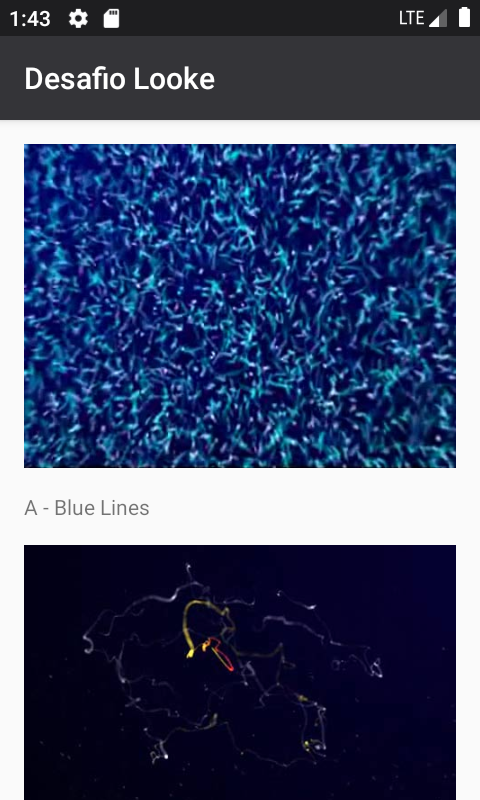

# Desafio Looke

## Descrição Geral

Tela A, carregar um json dinamicamente a partir da URL ***, fazer o parse e criar uma interface (lista) com os objetos disponíveis no json. Na lista deve ser mostrado o nome e a imagem do objeto.

    
    

## Arquitetura

Utilizei MVVM, com dois repositórios. Um deles, utiliza o conceito de "Single Source of Truth" para
fazer cache das medias. Todas as requisições HTTP, bem como salvamento em disco, são assíncronos. 

## Descrição técnica

Utilizei as seguintes bibliotecas:

- Retrofit: Para consultas http 

- RxAndroid: Utilizei `Observable` e `Emitter` para realizar a consulta http e para salvar em disco
as medias, respeitando o conceito de "Single Source of Truth".

- Exoplayer: Para reprodução de media (audio e vídeo). 

- Dagger: Para injeção de dependências.

## Quebra das tarefas

(Link para o Trello)[https://trello.com/b/Nzneu2Lg/desafio-looke]

## Atividades não realizadas

- Melhoria de UI;

- Adicionar testes (só tem um unitário).

